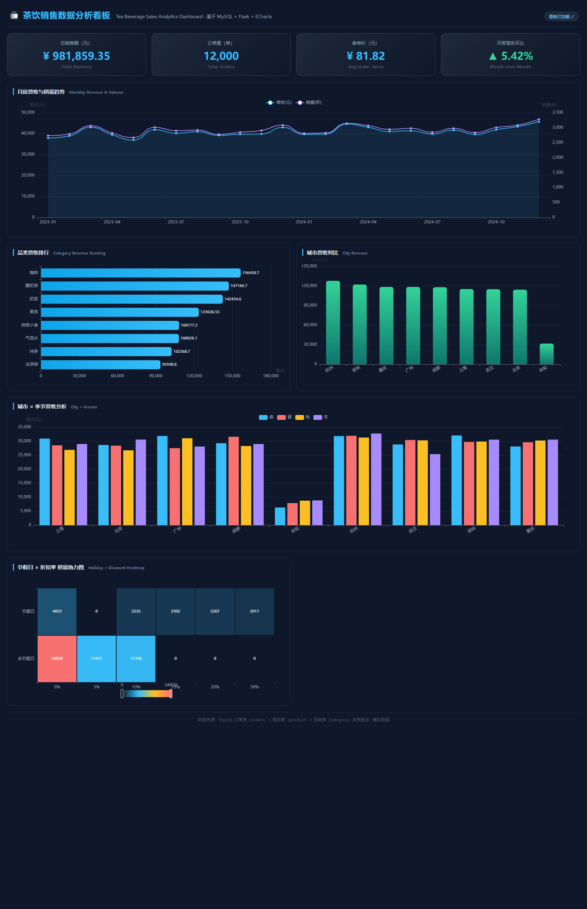

# 🍵 茶饮销售数据分析看板

基于 **Python + MySQL + Flask + ECharts** 的茶饮销售数据分析 Web 看板项目，用于数据清洗、SQL 多表分析、接口开发与前端可视化的一体化实践，**可作为数据分析师求职作品集项目**。



---

## 一、项目简介

本项目以一家连锁茶饮品牌的销售数据为分析对象，完成 **数据生成 → 数据清洗 → MySQL 存储 → SQL 多维分析 → Flask 接口 → ECharts 可视化** 的完整链路，最终呈现一个可交互的销售数据看板，涵盖：

- KPI 总览（总销售额、订单量、客单价、月度环比）
- 月度营收 / 销量趋势（折线图）
- 品类营收排行（多表 JOIN + 窗口函数 RANK）
- 城市营收对比、城市 × 季节营收分析（分组柱状图）
- 节假日 × 折扣率 销量热力图

> **技术亮点**：MySQL 多表 JOIN / GROUP BY / 窗口函数；pandas 缺失值与异常值清洗；Flask RESTful 接口；ECharts 双轴折线、横向柱状、分组柱状、热力图。

---

## 二、技术栈

| 层级 | 技术 | 说明 |
|------|------|------|
| 数据库 | MySQL 8.0+ | 3 张表（category / product / orders），外键关联 |
| 后端 | Python Flask 3.x | RESTful 接口，返回 JSON |
| 数据处理 | pandas / numpy | 脏数据清洗、二次分析 |
| 驱动 | PyMySQL | Python 访问 MySQL |
| 前端 | HTML / CSS / JavaScript / ECharts 5.x | 交互式可视化看板 |

---

## 三、功能模块（对应开发步骤）

| 模块 | 内容 | 交付 |
|------|------|------|
| 01 | 项目简介 | 本 README |
| 02 | 创建 Flask 项目，连接 MySQL | `app.py`、`config.py`、`db/` |
| 03 | 数据初始化 + 清洗 | `sql/`、`scripts/generate_data.py`、`clean_data.py`、`load_data.py` |
| 04 | 前端页面框架（KPI 卡片、图表容器） | `templates/index.html`、`static/css/style.css` |
| 05 | KPI 总览（SQL 多表查询 + Flask 接口） | `/api/kpi`、`services/kpi_service.py` |
| 06 | 核心图表（月度营收/销量趋势） | `/api/monthly_trend`、折线图 |
| 07 | 城市、季节维度图表 | `/api/city_revenue`、`/api/city_season`、柱状图 |
| 08 | 热力图 + 节假日折扣分析 | `/api/heatmap`、热力图 |

---

## 四、项目目录结构

```
tea-sales-dashboard/
├── app.py                    # Flask 主应用（页面 + 6 个 JSON 接口）
├── config.py                 # MySQL 连接配置与文件路径
├── requirements.txt          # Python 依赖
├── README.md                 # 本说明文档
│
├── sql/
│   ├── create_tables.sql     # 建库建表（category/product/orders）
│   └── insert_data.sql       # 品类、商品、样例订单数据
│
├── scripts/
│   ├── generate_data.py      # 生成大规模模拟数据（含脏数据）
│   ├── clean_data.py         # pandas 清洗缺失值/异常值
│   └── load_data.py          # 清洗后数据批量导入 MySQL
│
├── db/
│   ├── db_connect.py         # MySQL 连接 / 可用性探测
│   └── queries.py            # SQL 查询定义（JOIN/GROUP BY/窗口函数）
│
├── data/
│   ├── repository.py         # 数据访问层（MySQL 优先，CSV 降级演示）
│   ├── raw_tea_orders.csv    # 生成的原始脏数据
│   └── cleaned_tea_orders.csv# 清洗后的数据
│
├── services/
│   ├── kpi_service.py        # KPI 二次分析
│   └── chart_service.py      # 图表数据整理
│
├── templates/
│   └── index.html            # 看板页面
├── static/
│   ├── css/style.css         # 看板样式
│   └── js/kpi.js、charts.js  # KPI 与 ECharts 图表脚本
└── docs/
    └── dashboard_preview.png # 看板效果预览图
```

---

## 五、数据库设计（3 张表，多表关联）

- **category（品类表）**：`category_id`(PK)、`category_name`、`description`
- **product（商品表）**：`product_id`(PK)、`product_name`、`category_id`(FK→category)、`base_price`
- **orders（订单明细表）**：`order_id`、`order_date`、`city`、`season`、`is_holiday`、`discount_rate`、`product_id`(FK→product)、`quantity`、`unit_price`、`amount`；复合主键 `(order_id, product_id)`

```sql
-- 例：品类营收排名（多表 JOIN + 窗口函数）
SELECT
    c.category_name,
    ROUND(SUM(o.amount), 2)                   AS revenue,
    RANK() OVER (ORDER BY SUM(o.amount) DESC) AS rnk
FROM orders o
JOIN product p ON o.product_id = p.product_id
JOIN category c ON p.category_id = c.category_id
GROUP BY c.category_name
ORDER BY revenue DESC;
```

---

## 六、快速开始

### 1. 环境准备
- 安装 **MySQL 8.0+**、**Python 3.9+**

### 2. 创建虚拟环境并安装依赖
```bash
cd tea-sales-dashboard
python -m venv .venv
# Windows
.venv\Scripts\activate
# macOS / Linux
source .venv/bin/activate

pip install -r requirements.txt
```

### 3. 配置数据库连接
编辑 `config.py`，将 `password` 改为你的 MySQL 密码：

```python
DB_CONFIG = {
    "host": "localhost",
    "user": "root",
    "password": "your_password",   # ← 修改为你的密码
    "database": "tea_sales",
    ...
}
```

### 4. 初始化数据库（建表 + 插入种子数据）
```bash
mysql -u root -p < sql/create_tables.sql
mysql -u root -p tea_sales < sql/insert_data.sql
```

### 5. （可选）生成并导入大规模模拟数据
```bash
python scripts/generate_data.py   # 生成约 2.4 万条订单明细（含脏数据）
python scripts/clean_data.py      # pandas 清洗缺失值/异常值
python scripts/load_data.py       # 批量导入 MySQL orders 表
```

### 6. 启动看板
```bash
python app.py
# 浏览器访问: http://127.0.0.1:5000
```

> **无 MySQL 也能演示**：若未配置 MySQL，看板会自动降级为 **CSV 演示模式**，直接基于 `data/cleaned_tea_orders.csv` 渲染，便于快速查看效果。

---

## 七、接口文档

| 接口 | 说明 | 返回示例 |
|------|------|----------|
| `GET /` | 看板页面 | HTML |
| `GET /api/kpi` | KPI 总览 | `{total_revenue, total_orders, avg_order_value, mom_growth}` |
| `GET /api/monthly_trend` | 月度营收/销量 | `{months[], revenue[], volume[]}` |
| `GET /api/city_revenue` | 城市营收对比 | `{cities[], revenue[], orders[], avg_order[]}` |
| `GET /api/city_season` | 城市×季节 | `{cities[], seasons[], series{}}` |
| `GET /api/category_rank` | 品类营收排行 | `{names[], revenue[], rnk[]}` |
| `GET /api/heatmap` | 节假日×折扣率 | `{x_labels[], y_labels[], data[[x,y,value]]}` |

---

## 八、数据清洗策略（scripts/clean_data.py）

| 问题 | 策略 |
|------|------|
| city 缺失 | 填充为「未知」 |
| quantity 缺失 | 用众数填充 |
| amount 缺失 | 按 `quantity × unit_price` 重算 |
| quantity ≤ 0 | 异常，改为最小合法量 1 |
| unit_price < 0 | 取绝对值 |
| amount 与实算严重不符 | IQR 判定后重算 |
| amount ≤ 0 | 重算兜底 |

清洗报告示例（2.4 万条）：
```
city 缺失填充为'未知': 780 条
quantity 缺失填充为众数 1: 207 条
amount 缺失按 quantity*unit_price 重算: 238 条
quantity<=0 异常改为 1: 369 条
unit_price<0 取绝对值: 250 条
amount 与实算不符重算: 809 条
```

---

## 九、简历项目描述（数据分析师方向）

> **茶饮销售数据分析看板（Python + MySQL + Flask + ECharts）**
>
> 独立开发茶饮品牌销售数据分析 Web 看板，覆盖「数据生成 → 清洗 → 存储 → 分析 → 可视化」全链路。设计 3 张关联表（品类/商品/订单），使用 SQL 多表 JOIN、GROUP BY 与窗口函数完成 KPI 总览、品类营收排名、城市×季节维度及节假日折扣分析；基于 pandas 实现缺失值（众数/重算填充）与异常值（IQR 判定、边界修正）清洗，清洗 2.4 万条模拟订单；Flask 提供 6 个 RESTful 接口，ECharts 实现双轴折线、横向柱状、分组柱状与热力图等 5 类可视化。该项目体现了数据库建模、SQL 分析、Python 数据处理与前端可视化的综合能力。

---

## 十、License
本项目仅用于学习与求职作品展示，模拟数据不涉及真实业务信息。
